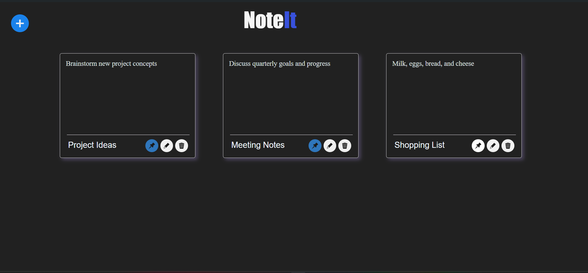

# Note-Taking App

This project is a note-taking application built with Django and Django REST framework for the backend and React for the frontend. It utilizes MySQL for the database.

## Project Description

The Note-Taking App enables users to manage notes efficiently with an intuitive interface. Users can create, edit, delete, and pin notes, enhancing productivity and organization. The app includes user authentication for secure access. It displays notes in a card format and provides features like sorting based on pin status and creation date, hover information for creation and last edited dates, and integration with Draft.js for the text editor.

## Key Features

- **Create Notes**: Users can create new notes with a default title "Untitled".
- **Edit Notes**: Edit the content and title of existing notes seamlessly.
- **Delete Notes**: Remove notes that are no longer needed.
- **Pin Notes**: Pin important notes to keep them prominently displayed.
- **Sort Notes**: Notes are sorted based on their pinned status and creation date.
- **Hover Info**: Displays creation and last edited dates on hovering over a note.
- **Text Editor**: Utilizes Draft.js for rich text editing capabilities.
- **Authentication**: Secure user authentication system ensures user data privacy and personalized note management.

## MySQL Database

The database schema for the notes table remains:

```sql
CREATE TABLE notes (
  id VARCHAR(10) PRIMARY KEY,
  name VARCHAR(255) NOT NULL,
  content TEXT NOT NULL,
  is_editing BOOLEAN NOT NULL DEFAULT FALSE,
  pin_status BOOLEAN NOT NULL DEFAULT FALSE,
  created_at DATETIME NOT NULL DEFAULT CURRENT_TIMESTAMP,
  updated_at DATETIME NOT NULL DEFAULT CURRENT_TIMESTAMP ON UPDATE CURRENT_TIMESTAMP
);

```
## Project Set-up
1. Installing necessary back-end frameworks
```bash
pip install django djangorestframework
```
2. Setting up the project files in your local system
```bash
git clone <url>
cd NoteIt
```
3. Running the application
```bash
python manage.py migrate
python manage.py runserver
```
4. Open http://localhost:3000 for the app.

<p style="color:red"><strong>Note:</strong></p>  Necessary front-end files are available in the assets folder of the NoteIt directory, there is no need to explicitly set up react files. The front-end files are present in the notes directory.

## Here's how the project looks like


